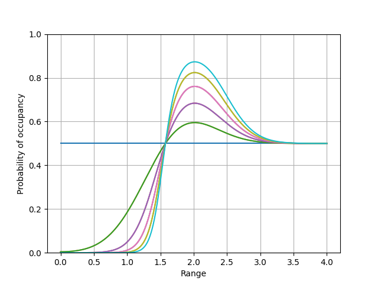
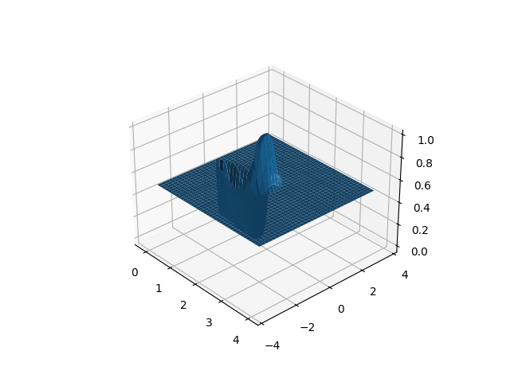

# Occupancy Gridmaps

This repository aims to replicate the figures and techniques of "Occupancy Grids: A Stochastic 
Spatial Representation for Active Robot Perception" (1989) by Alberto Elfes ([link](https://arxiv.org/abs/1304.1098)).

### 1D Occupancy

`1D-occupancy.py` replicates Figure 2 which illustrates a 1D example of the occupancy gridmap given
a detection at `r=2`.

### 2D Occupancy

`2D-occupancy.py` replicates Figure 3 which illustrates a 2D example of the occupancy gridmap for a
sonar detection. Sonar has a depth and angle probability, so the detection is modeled in polar
coordinates and then mapped to cartesian coordinates.

